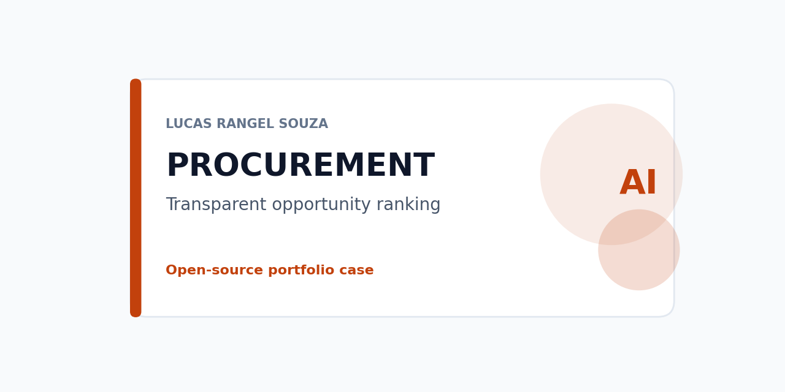
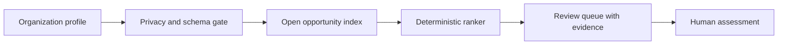

# PNCP opportunity recommender



A transparent retrieval and ranking reference for procurement opportunities. It accepts an organization-level profile and returns open opportunities with the matching terms, modality, location constraints, and official source link that produced each rank.



## Safety boundary

The result is a relevance signal. It does not determine supplier eligibility, compliance, profit, suitability, or probability of winning. The profile excludes personal identifiers. Any decision requires a human review of the official notice, item specification, deadlines, and organizational capacity.

## Run locally

```powershell
make check
python -m pncp_recommender --profile data\profile_fixture.json --opportunities data\opportunities_fixture.json --as-of 2026-09-24 --output artifacts\rankings.json
```

The project currently uses only synthetic fixtures. A future integration must use a pinned, reviewed `brazil-pncp-procurement-history` dataset version. The repository does not contain an API token, Kaggle credential, or unreviewed public-source extract.

## Evaluation

The offline evaluator reports Recall, MRR, and binary nDCG from a labeled relevance set. Fixture tests cover deterministic ranks, constraint filtering, organization-only profile validation, and metric calculation. A broader benchmark must be created from documented public records before reporting quality claims.

## Status

The fixture-first implementation, documentation, release controls, and CI are available now. A pinned public procurement release and a documented benchmark remain prerequisites for any real-data quality claim.
