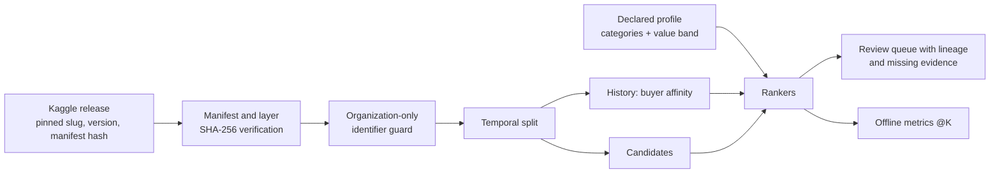

# PNCP opportunity recommender


A transparent ranking reference for Brazilian public procurement notices. Given a declared supplier profile, it returns candidate notices with the score contribution of every feature, the evidence it lacks, and a link to the public PNCP record. It runs on a pinned, hash-verified public dataset release and on synthetic fixtures. It does not estimate eligibility or the chance of winning.

## Architecture



*Alt text: the pinned Kaggle release is verified, filtered to organization identifiers, and split by time. Earlier notices produce buyer-affinity counts; later notices are ranked against a declared profile into a review queue and an evaluation report.*

## Capabilities and non-goals

Implemented and tested:

- release resolver that pins `lucasrangelss/brazil-pncp-procurement-history` version 1 and rejects any other manifest or altered layer ([release.py](pncp_recommender/release.py));
- CNPJ check-digit guard that keeps only organization identifiers and treats any 11-digit value as a possible CPF ([identifiers.py](pncp_recommender/identifiers.py));
- three rankers on release data: recency, category and value filter, and a weighted ranker that reports each contribution ([notices.py](pncp_recommender/notices.py));
- Recall@K, MRR, and graded nDCG@K ([evaluation.py](pncp_recommender/evaluation.py));
- a batch review queue where every row carries dataset version, manifest hash, code commit, profile schema, and ranker version ([experiment.py](pncp_recommender/experiment.py));
- a learning-to-rank interface that is disabled by default, requires consent for non-synthetic events, and refuses synthetic events for a real-propensity claim ([learning_to_rank.py](pncp_recommender/learning_to_rank.py));
- the original fixture path with lexical term overlap, deadline, status, modality, and state constraints ([ranking.py](pncp_recommender/ranking.py)).

Not provided: open-opportunity search on real data (release v1 has no status or deadline), lexical or embedding retrieval on real data (no item text), organization-history profiles and item-to-supplier discovery (supplier results are not released), eligibility, compliance, profitability, or win-probability estimates.

## Quick start

Python 3.10 or later. No Kaggle account is needed; the dataset is public.

```powershell
python -m pip install -e ".[release]"
make check
make reproduce
```

`make reproduce` downloads release version 1, verifies it, and writes `artifacts/release-v1/evaluation.json` and `review_queue.jsonl`. The command prints row counts (1,979 release rows, 831 history, 1,148 candidates) and the metric table below. For an offline run, pass `--release-dir` with a copy of the dataset files; verification still applies.

The fixture path needs no download:

```powershell
python -m pncp_recommender rank-fixture --profile data\profile_fixture.json --opportunities data\opportunities_fixture.json --as-of 2026-09-24 --output artifacts\rankings.json
```

## Repository structure

```text
pncp_recommender/   resolver, identifier guard, rankers, evaluation, experiment, CLI
data/               synthetic profiles and fixture opportunities
tests/              unit and release-verification tests (temporary Parquet, no network)
docs/adr/           architecture decisions
docs/evidence/      dated evaluation records
articles/           article source
```

## Data, licensing, and privacy

Release data comes from the PNCP public consultation API through the reviewed Kaggle derivative produced by [brazil-public-data-map](https://github.com/LucasRangelSSouza/brazil-public-data-map). The dataset is published under Kaggle's `other` setting, and the PNCP terms apply; the Apache-2.0 license of this repository covers code only. The release excludes free-text subjects, personal data, contacts, and supplier results. Declared profiles accept only categories and a value band. Profiles are synthetic and labeled as such.

## Evaluation

The [2026-09-25 evaluation](docs/evidence/pncp-release-v1-evaluation-2026-09-25.md) used six synthetic profiles on the temporal split. Judgments are rule-derived (grade 2 for category and value band, grade 1 for category only), so the numbers measure constraint adherence, not user relevance.

| Ranker | Recall@10 | nDCG@10 | Recall@50 | nDCG@50 |
|---|---:|---:|---:|---:|
| Recency, no filter | 0.1667 | 0.0616 | 0.1685 | 0.0764 |
| Category and value filter | 1.0000 | 1.0000 | 0.8307 | 0.9484 |
| Weighted transparent | 1.0000 | 0.9345 | 1.0000 | 0.9135 |

The filter wins at K=10 because it implements the grade-2 rule. The weighted ranker keeps grade-1 notices and lets buyer recurrence move some of them up, which costs nDCG against these labels. Two runs at the same commit produced byte-identical outputs.

## Testing and CI

`make check` runs 22 unit tests. They build temporary Parquet releases to cover hash verification, identifier exclusion, temporal lineage, determinism, ranking explanations, metrics, and the learning-to-rank boundary without network access. GitHub Actions runs the same suite and a credential-pattern scan on every push.

## Deployment

None. The recommender is a batch CLI. A serving interface is out of scope until real interaction data and an approved use exist.

## Trade-offs and limitations

Release v1 covers seven days of one modality, so category and buyer statistics are thin. Rule-derived judgments cannot separate a good ranker from one that copies the rule. The value fit decays by order of magnitude outside the band, a choice made for readability rather than tuned against outcomes.

## Security and responsible use

Results are review signals. Every row carries `review_required`, `eligibility_not_assessed`, and `win_probability_not_estimated`, lists missing evidence, and links to the official notice. No credential is needed or stored. Report vulnerabilities through [SECURITY.md](SECURITY.md).

## Replication and evidence

Run `make reproduce` twice and compare SHA-256 values of the two output files; at commit `02bd7d0` they were `9bbac855…c037c` and `35beeba0…ab311` ([full record](docs/evidence/pncp-release-v1-evaluation-2026-09-25.md)).

## Articles

The article draft is in [articles/transparent-procurement-ranking.md](articles/transparent-procurement-ranking.md). It has not been published elsewhere.

## Roadmap

- Pin a later release that includes deadlines and item descriptions, then enable lexical retrieval on real data.
- Add supplier-result tables after their identifier review in `brazil-public-data-map`.
